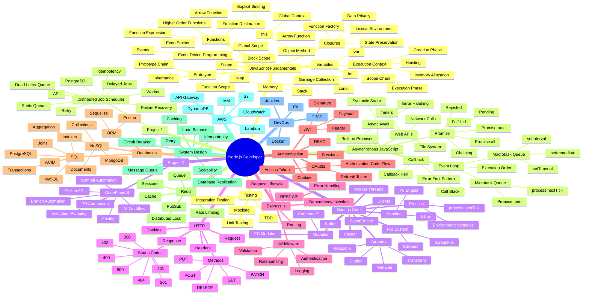

```mermaid
mindmap
  root((Node.js Developer))

    JavaScript Fundamentals

      Execution Context
        Creation Phase
        Execution Phase
        Memory Allocation
        Hoisting
        Scope Chain

      Variables
        var
        let
        const

      Memory
        Stack
        Heap
        Garbage Collection

      Scope
        Global Scope
        Function Scope
        Block Scope

      Closures
        Lexical Environment
        Data Privacy
        Function Factory
        State Preservation

      this
        Global Context
        Object Method
        Explicit Binding
        Arrow Function

      Functions
        Function Declaration
        Function Expression
        Arrow Function
        Higher Order Functions

      Prototype
        Prototype Chain
        Inheritance

      Event Driven Programming
        Events
        EventEmitter

    Asynchronous JavaScript

      Callback
        Callback Hell
        Error First Pattern

      Promise
        Pending
        Fulfilled
        Rejected
        Chaining
        Promise.all
        Promise.race

      Async Await
        Built on Promises
        Syntactic Sugar
        Error Handling

      Event Loop

        Call Stack

        Microtask Queue
          Promise.then
          process.nextTick

        Macrotask Queue
          setTimeout
          setInterval
          setImmediate

        Execution Order

      Web APIs
        Timers
        Network Calls
        File System

    Node.js Core

      Runtime
        V8 Engine
        Libuv

      Modules
        CommonJS
        ES Modules

      File System
        fs.readFile
        Streams

      Buffer

      Streams
        Readable
        Writable
        Duplex
        Transform

      Events
        EventEmitter

      Process
        Environment Variables
        process.nextTick

      Cluster

      Worker Threads

    HTTP

      Request
      Response

      Methods
        GET
        POST
        PUT
        PATCH
        DELETE

      Headers
      Cookies

      Status Codes
        200
        201
        400
        401
        403
        404
        500

    Express.js

      Routing

      Middleware
        Authentication
        Logging
        Validation
        Rate Limiting

      Error Handling

      Request Lifecycle

      REST API

      Dependency Injection

    Authentication

      Sessions

      Cookies

      JWT
        Header
        Payload
        Signature

      OAuth2
        Authorization Code Flow
        Access Token
        Refresh Token

      RBAC

    Databases

      SQL

        PostgreSQL

        MySQL

        ACID

        Transactions

        Joins

        Indexes

      NoSQL

        MongoDB

        Documents

        Collections

        Aggregation

      ORM
        Sequelize
        Prisma

    Redis

      Cache

      Sessions

      Queue

      PubSub

      Distributed Lock

      Rate Limiting

    System Design

      Scalability

      Load Balancer

      Caching

      Database Replication

      Message Queue

      Retry

      Idempotency

      Circuit Breaker

    AWS

      Lambda

      API Gateway

      S3

      DynamoDB

      CloudWatch

      IAM

    DevOps

      Git

      Docker

      CI/CD

      Jenkins

    Testing

      Unit Testing

      Integration Testing

      Mocking

      TDD

    Project 1

      Distributed Job Scheduler

        API

        Redis Queue

        Worker

        PostgreSQL

        Retry

        Dead Letter Queue

        Delayed Jobs

        Idempotency

        Failure Recovery

    Project 2

      CodePlaneAI

        Fastify

        GitHub API

        Branch Automation

        Commit Automation

        PR Automation

        Execution Planning

        AI Workflow
```